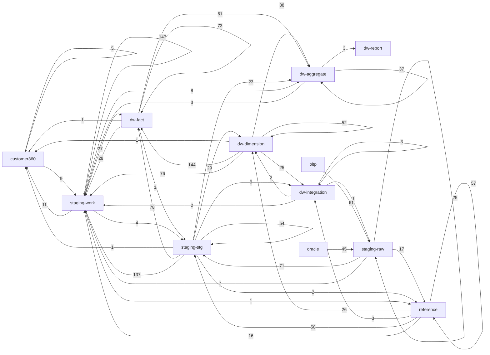

# SSIS table dependency graph

Generated by `validation/checks/extract_sql_lineage.py`. This is static-only analysis of checked-in XML and SQL; no package or query was executed. Control-framework and reject tables are excluded; see `shared-plumbing.md`.

## Headline numbers

| Metric | Value |
| --- | ---: |
| Packages parsed | 205 |
| SQL statements | 2888 |
| Pipelines | 201 |
| Pipeline components | 1527 |
| Distinct objects read | 410 |
| Distinct objects written | 217 |
| Table edges | 1474 |
| Unresolved procedures | 12 |

## Plumbing volume excluded

| Object class | References |
| --- | ---: |
| etl-control reads | 1522 |
| etl-control writes | 1685 |
| staging-err writes | 217 |

## Layer-flow matrix

| From \ To | customer360 | dw-aggregate | dw-dimension | dw-fact | dw-integration | dw-report | oltp | oracle | reference | staging-raw | staging-stg | staging-work |
| --- | ---: | ---: | ---: | ---: | ---: | ---: | ---: | ---: | ---: | ---: | ---: | ---: |
| customer360 | 5 | 0 | 0 | 0 | 0 | 0 | 0 | 0 | 0 | 0 | 0 | 9 |
| dw-aggregate | 0 | 37 | 0 | 0 | 0 | 3 | 0 | 0 | 0 | 0 | 0 | 3 |
| dw-dimension | 1 | 38 | 52 | 144 | 25 | 0 | 0 | 0 | 0 | 0 | 0 | 76 |
| dw-fact | 1 | 61 | 0 | 73 | 0 | 0 | 0 | 0 | 0 | 0 | 1 | 28 |
| dw-integration | 0 | 0 | 2 | 0 | 3 | 0 | 0 | 0 | 0 | 1 | 0 | 2 |
| dw-report | 0 | 0 | 0 | 0 | 0 | 0 | 0 | 0 | 0 | 0 | 0 | 0 |
| oltp | 0 | 0 | 0 | 0 | 0 | 0 | 0 | 0 | 0 | 61 | 0 | 0 |
| oracle | 0 | 0 | 0 | 0 | 0 | 0 | 0 | 0 | 0 | 45 | 0 | 0 |
| reference | 0 | 0 | 26 | 0 | 3 | 0 | 0 | 0 | 57 | 0 | 50 | 16 |
| staging-raw | 0 | 0 | 0 | 0 | 0 | 0 | 0 | 0 | 17 | 25 | 71 | 7 |
| staging-stg | 1 | 23 | 29 | 78 | 9 | 0 | 0 | 0 | 2 | 0 | 54 | 137 |
| staging-work | 11 | 8 | 0 | 27 | 0 | 0 | 0 | 0 | 1 | 0 | 4 | 147 |

## Hub objects by packages reading

| Object | Packages |
| --- | ---: |
| DIMENSION.DATE | 34 |
| DIMENSION.CUSTOMER | 28 |
| DIMENSION.STOCK ITEM | 22 |
| REF.CODECROSSWALK | 21 |
| FACT.SALE | 17 |
| DIMENSION.SUPPLIER | 14 |
| REF.COUNTRY | 12 |
| REF.REASONCODE | 12 |
| REF.REGION | 12 |
| STG.STOCKITEM | 12 |
| STG.CUSTOMER | 11 |
| REF.STATUSCODE | 10 |
| STG.SALELINE | 10 |
| STG.FXRATE | 9 |
| DIMENSION.SALES TERRITORY | 8 |
| FACT.RETURN | 8 |
| REF.FXRATEDAILY | 8 |
| WORK.LATEARRIVINGDIMENSIONQUEUE | 8 |
| FACT.PAYMENT | 7 |
| RAW.ORACLEGEOGRAPHY | 7 |
| RAW.SQLORDER | 7 |
| REF.CURRENCY | 7 |
| DIMENSION.CURRENCY | 6 |
| RAW.ORACLEPRODUCTMASTER | 6 |
| STG.CURRENCYRATE | 6 |

## Hub objects by packages writing

| Object | Packages |
| --- | ---: |
| WORK.LATEARRIVINGDIMENSIONQUEUE | 11 |
| REF.CODECROSSWALK | 9 |
| INTEGRATION.DIMENSIONLOADAUDIT | 8 |
| FACT.SALE | 7 |
| RAW.SQLINVOICE | 5 |
| RAW.SQLORDER | 5 |
| WORK.CURRENCYCONVERSIONSCRATCH | 5 |
| DIMENSION.CUSTOMER | 4 |
| STG.CUSTOMER | 4 |
| WORK.CUSTOMERDEDUP | 4 |
| WORK.ORDERLINEENRICHED | 4 |
| WORK.PAYMENTMATCHED | 4 |
| WORK.PRODUCTCROSSWALK | 4 |
| AGGREGATE.SUPPLIER PERFORMANCE | 3 |
| FACT.PAYMENT | 3 |
| RAW.FILEPARTNERSALES | 3 |
| REF.REASONCODE | 3 |
| REF.REGION | 3 |
| WORK.CUSTOMERADDRESSSTANDARDIZED | 3 |
| AGGREGATE.CUSTOMER 360 | 2 |
| AGGREGATE.CUSTOMER ROLLING 12 MONTH | 2 |
| AGGREGATE.DAILY INVENTORY HEALTH | 2 |
| AGGREGATE.FINANCE CLOSE SUMMARY | 2 |
| AGGREGATE.PROMOTION EFFECTIVENESS | 2 |
| AGGREGATE.REGIONAL SALES PERFORMANCE | 2 |

## Table graph hubs

| Object | Fan-in + fan-out |
| --- | ---: |
| FACT.SALE | 98 |
| WORK.LATEARRIVINGDIMENSIONQUEUE | 82 |
| DIMENSION.CUSTOMER | 74 |
| REF.CODECROSSWALK | 61 |
| DIMENSION.STOCK ITEM | 59 |
| DIMENSION.DATE | 57 |
| FACT.PAYMENT | 45 |
| DIMENSION.SUPPLIER | 38 |
| INTEGRATION.DIMENSIONLOADAUDIT | 34 |
| WORK.CURRENCYCONVERSIONSCRATCH | 33 |
| WORK.ORDERLINEENRICHED | 33 |
| FACT.ORDER | 32 |
| FACT.PURCHASE | 32 |
| WORK.PAYMENTMATCHED | 31 |
| FACT.PURCHASE RECEIPT | 30 |
| REF.REGION | 30 |
| STG.CUSTOMER | 29 |
| AGGREGATE.CUSTOMER ROLLING 12 MONTH | 27 |
| FACT.RETURN | 27 |
| RAW.SQLORDER | 27 |
| AGGREGATE.SUPPLIER PERFORMANCE | 26 |
| STG.SALELINE | 25 |
| DIMENSION.CITY | 24 |
| AGGREGATE.CUSTOMER 360 | 23 |
| AGGREGATE.PROMOTION EFFECTIVENESS | 21 |

## Distinct objects by folder

| Folder | Reads | Writes |
| --- | ---: | ---: |
| 01_oracle_extract | 48 | 18 |
| 02_sqlserver_extract | 60 | 13 |
| 03_file_ingestion | 5 | 4 |
| 04_staging | 79 | 43 |
| 05_data_quality | 14 | 1 |
| 06_reference_data | 20 | 25 |
| 07_dimensions | 50 | 27 |
| 08_facts | 109 | 30 |
| 09_aggregates | 50 | 14 |
| 10_finance | 18 | 9 |
| 11_sales | 23 | 11 |
| 12_inventory | 13 | 6 |
| 13_procurement | 16 | 10 |
| 14_customer_360 | 22 | 15 |
| 15_error_handling | 6 | 6 |
| 99_maintenance | 8 | 8 |

## Multi-writer contention

Total objects written by more than one package: 45.

| Object | Packages |
| --- | --- |
| AGGREGATE.CUSTOMER 360 | AGG_Refresh_Customer360, AGG_Refresh_CustomerRolling12Month |
| AGGREGATE.CUSTOMER ROLLING 12 MONTH | AGG_Refresh_Customer360, AGG_Refresh_CustomerRolling12Month |
| AGGREGATE.DAILY INVENTORY HEALTH | AGG_Refresh_DailyInventoryHealth, INV_Load_Replenishment |
| AGGREGATE.FINANCE CLOSE SUMMARY | AGG_Refresh_FinanceCloseSummary, FIN_Load_CostAllocation |
| AGGREGATE.PROMOTION EFFECTIVENESS | AGG_Refresh_PromotionEffectiveness, SLS_Load_PromotionRedemption |
| AGGREGATE.REGIONAL SALES PERFORMANCE | AGG_Refresh_RegionalSalesPerformance, SLS_Load_QuotaAttainment |
| AGGREGATE.SUPPLIER PERFORMANCE | AGG_Refresh_SupplierPerformance, PRC_Load_ContractCompliance, PRC_Load_SupplierScorecard |
| DIMENSION.CUSTOMER | DIM_APAC_Load_Customer, DIM_EU_Load_Customer, DIM_Load_CustomerSegment, DIM_NA_Load_Customer |
| FACT.DAILY INVENTORY SNAPSHOT | FACT_Load_DailyInventorySnapshot, INV_Load_DailySnapshot |
| FACT.GL POSTING | FACT_Load_GLPosting, FIN_Load_GlPostings |
| FACT.MOVEMENT | DIM_Rekey_LateArriving, FACT_Load_Movement |
| FACT.ORDER | FACT_Apply_Corrections, FACT_Load_Order |
| FACT.PAYMENT | FACT_Apply_Corrections, FACT_Load_Payment, FIN_Currency_Revaluation |
| FACT.PURCHASE | DIM_Rekey_LateArriving, FACT_Load_Purchase |
| FACT.PURCHASE RECEIPT | FACT_Load_PurchaseReceipt, PRC_Load_ReceiptMatching |
| FACT.SALE | DIM_Rekey_LateArriving, FACT_APAC_Load_Sale, FACT_Apply_Corrections, FACT_Dedup_Sale, FACT_EU_Load_Sale, FACT_Load_CreditNote, FACT_NA_Load_Sale |
| INTEGRATION.DIMENSIONLOADAUDIT | DIM_Load_City, DIM_Load_CustomerCategory, DIM_Load_CustomerSegment, DIM_Load_Promotion, DIM_Load_SalesTerritory, DIM_Load_StockItem, DIM_Load_Supplier, DIM_Load_VendorContract |
| RAW.FILEPARTNERSALES | ING_FILE_PartnerSales_APAC, ING_FILE_PartnerSales_EU, ING_FILE_PartnerSales_NA |
| RAW.ORACLEAPINVOICEHDR | EXT_ORA_ApAging, EXT_ORA_ApInvoiceHdr |
| RAW.ORACLEAPPAYMENT | EXT_ORA_ApPayment, EXT_ORA_ApPaymentApply |
| RAW.ORACLECUSTOMERMASTER | EXT_ORA_CodeTranslation, EXT_ORA_CustomerMaster |
| RAW.ORACLEGEOGRAPHY | EXT_ORA_Geography, EXT_SQL_Cities |
| RAW.ORACLEPRODUCTMASTER | EXT_ORA_ProductHierarchy, EXT_ORA_ProductMaster |
| RAW.SQLINVOICE | EXT_SQL_CustomerTransactions, EXT_SQL_Invoices, EXT_SQL_PaymentMethods, EXT_SQL_SupplierTransactions, EXT_SQL_TransactionTypes |
| RAW.SQLORDER | EXT_SQL_CustomerSegments, EXT_SQL_Orders, EXT_SQL_People, EXT_SQL_Promotions, EXT_SQL_SalesTerritories |
| RAW.SQLSTOCKMOVEMENT | EXT_SQL_StockMovements, EXT_SQL_StockTransfers |
| REF.CODECROSSWALK | REF_Load_Carrier, REF_Load_CodeTranslation, REF_Load_CostCenter, REF_Load_LoyaltyTier, REF_Load_PaymentMethod, REF_Load_PaymentTerms, REF_Load_ReturnReason, REF_Load_SalesChannel, REF_Load_TransactionType |
| REF.POSTALFORMATRULE | REF_Load_Geography, REF_Load_WarehouseSite |
| REF.REASONCODE | REF_Load_CodeTranslation, REF_Load_ReturnReason, REF_Load_UnknownMembers |
| REF.REGION | REF_Load_DateDimension, REF_Load_Geography, REF_Load_WarehouseSite |
| REF.SOURCEKEYCROSSWALK | REF_Load_UnknownMembers, STG_Work_CustomerDedup |
| REF.STATUSCODE | REF_Load_CodeTranslation, REF_Load_UnknownMembers |
| STG.CUSTOMER | STG_Load_Customer, STG_Load_Employee, STG_Load_PartnerSale, STG_Work_CustomerDedup |
| STG.ORDERLINE | DQ_Reject_Reprocess, STG_Load_Order |
| STG.PAYMENT | STG_Load_Payment, STG_Work_PaymentMatch |
| WORK.CURRENCYCONVERSIONSCRATCH | FACT_APAC_Load_Sale, FACT_EU_Load_Sale, STG_Load_ApInvoice, STG_Load_Currency, STG_Load_GlJournal |
| WORK.CUSTOMERADDRESSSTANDARDIZED | DIM_Load_City, STG_Load_CustomerAddress, STG_Work_CustomerDedup |
| WORK.CUSTOMERDEDUP | DIM_EU_Load_Customer, DIM_Load_CustomerCategory, DIM_NA_Load_Customer, STG_Work_CustomerDedup |
| WORK.FACTREKEYQUEUE | DIM_Rekey_LateArriving, FACT_Apply_Corrections |
| WORK.LATEARRIVINGDIMENSIONQUEUE | DIM_Load_City, DIM_Load_StockItem, DIM_Rekey_LateArriving, FACT_APAC_Load_Sale, FACT_EU_Load_Sale, FACT_Load_CustomerTransaction, FACT_Load_Movement, FACT_Load_Order, FACT_Load_Purchase, FACT_NA_Load_Sale, STG_Load_Order |

## External inputs

Total objects read but never written: 217.

| Object |
| --- |
| AGGREGATE.CUSTOMER AR POSITION |
| AGGREGATE.CUSTOMER LOYALTY POSITION |
| AGGREGATE.CUSTOMER RETURN POSITION |
| AGGREGATE.CUSTOMER WEB POSITION |
| AGGREGATE.PERIOD CALENDAR |
| AGGREGATE.PROMOTION BASELINE |
| AGGREGATE.PROMOTION ELIGIBILITY |
| AGGREGATE.SUB LEDGER CONTROL TOTAL |
| AGGREGATE.SUPPLIER QUALITY POSITION |
| AGGREGATE.TERRITORY QUOTA |
| APPLICATION.CITIES |
| APPLICATION.COUNTRIES |
| APPLICATION.PAYMENTMETHODS |
| APPLICATION.PEOPLE |
| APPLICATION.STATEPROVINCES |
| APPLICATION.TRANSACTIONTYPES |
| CUSTOMER360.CUSTOMERPROFILE |
| DIMENSION.' + REPLACE(@DIMENSIONNAME, N' |
| DIMENSION.COUNTRY |
| DIMENSION.DEVICE TYPE |
| DIMENSION.GL ACCOUNT |
| DIMENSION.LOYALTY SCHEME |
| DIMENSION.MARKETING CAMPAIGN |
| DIMENSION.PARTNER |
| DIMENSION.PRODUCT HIERARCHY |
| DIMENSION.PROFIT CENTER |
| DIMENSION.REGION |
| DIMENSION.SUPPLIER CATEGORY |
| DIMENSION.TAX JURISDICTION |
| ECOMMERCE.CARTHEADERS |
| ECOMMERCE.WEBSESSIONS |
| FACT.MONTHLY AP AGING |
| FACT.MONTHLY AR AGING |
| FACT.MONTHLY CUSTOMER BALANCE |
| FACT.PROMOTION ELIGIBILITY |
| FACT.SALES MARGIN |
| INTEGRATION.CHANGETRACKINGWATERMARK |
| INTEGRATION.LATEARRIVINGMEMBERQUEUE |
| LOYALTY.LOYALTYMEMBERS |
| LOYALTY.LOYALTYPOINTSLEDGER |

## Dead ends

Total objects written but never read: 24.

| Object |
| --- |
| CUSTOMER360.CUSTOMERSEGMENT |
| DIMENSION.UNKNOWN MEMBER |
| FACT.CUSTOMER TRANSACTION |
| FACT.SALE DUPLICATE ARCHIVE |
| FACT.TRANSACTION |
| INTEGRATION.DIMENSIONLOADAUDIT |
| RAW.ORACLERECEIPTLINE |
| REPORT.PUBLISHSTATE |
| STG.CURRENCY |
| STG.LOYALTYLEDGER |
| STG.PARTNERSALE |
| STG.PURCHASEORDER |
| WORK.COMMISSIONNA |
| WORK.CUSTOMERADDRESSSTANDARDIZED |
| WORK.CUSTOMERCHURNFLAG |
| WORK.GLHELDLINE |
| WORK.PARTNERFEEDARCHIVE |
| WORK.PRODUCTCROSSWALKFEED |
| WORK.PROMOTIONREDEMPTION |
| WORK.RECEIPTMATCH |
| WORK.STOCKTRANSFERRECEIPTONLY |
| WORK.SUPPLIERDEDUP |
| WORK.SUPPLIERSTATEMENTARCHIVE |
| WORK.WITHHOLDINGCERTIFICATEQUEUE |

## Declared versus parsed

| Reconciliation metric | Total |
| --- | ---: |
| declared_sources_not_parsed | 22 |
| parsed_reads_not_declared | 582 |
| declared_targets_not_parsed | 21 |
| parsed_writes_not_declared | 45 |

### Top offenders

| Package | Differences |
| --- | ---: |
| FACT_Load_Purchase | 14 |
| FACT_Load_CreditNote | 13 |
| FACT_Load_GLPosting | 13 |
| FACT_Load_Payment | 12 |
| FACT_Load_PurchaseReceipt | 12 |
| FACT_Load_Return | 12 |
| FACT_Load_SupplierPayment | 12 |
| REF_Load_Geography | 12 |
| REF_Load_UnknownMembers | 11 |
| FACT_Load_Order | 10 |
| FACT_Load_Shipment | 10 |
| STG_Load_Shipment | 10 |
| FACT_Load_WebSession | 9 |
| REF_Load_TransactionType | 9 |
| DIM_Load_City | 8 |
| DIM_Rekey_LateArriving | 8 |
| FACT_Load_LoyaltyPoints | 8 |
| REF_Load_CodeTranslation | 8 |
| STG_Load_Order | 8 |
| C360_Publish_Segments | 7 |
| FACT_EU_Load_Sale | 7 |
| FACT_Load_OrderFulfilment | 7 |
| FACT_Load_StockHolding | 7 |
| REF_Load_WarehouseSite | 7 |
| STG_Load_Sale | 7 |
