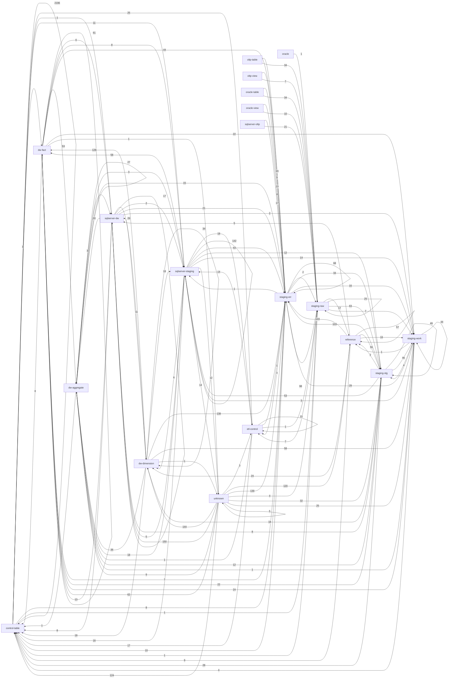

# SSIS table dependency graph

Generated by `validation/checks/extract_sql_lineage.py`. This is static-only analysis of checked-in XML and SQL; no package or query was executed.

## Headline numbers

| Metric | Value |
| --- | ---: |
| Packages parsed | 205 |
| SQL statements | 2888 |
| Pipelines | 201 |
| Pipeline components | 1527 |
| Distinct objects read | 737 |
| Distinct objects written | 254 |
| Table edges | 5575 |
| Unresolved procedures | 12 |

## Layer-flow matrix

| From \ To | control-table | dw-aggregate | dw-dimension | dw-fact | etl-control | oltp-table | oltp-view | oracle | oracle-table | oracle-view | reference | sqlserver-dw | sqlserver-oltp | sqlserver-staging | staging-err | staging-raw | staging-stg | staging-work | unknown |
| --- | ---: | ---: | ---: | ---: | ---: | ---: | ---: | ---: | ---: | ---: | ---: | ---: | ---: | ---: | ---: | ---: | ---: | ---: | ---: |
| control-table | 2196 | 0 | 0 | 1 | 25 | 0 | 0 | 0 | 0 | 0 | 0 | 1 | 0 | 11 | 8 | 1 | 0 | 0 | 0 |
| dw-aggregate | 1 | 27 | 0 | 0 | 0 | 0 | 0 | 0 | 0 | 0 | 0 | 3 | 0 | 3 | 15 | 0 | 0 | 0 | 0 |
| dw-dimension | 18 | 36 | 34 | 128 | 0 | 0 | 0 | 0 | 0 | 0 | 0 | 29 | 0 | 19 | 138 | 0 | 0 | 58 | 1 |
| dw-fact | 8 | 53 | 0 | 61 | 0 | 0 | 0 | 0 | 0 | 0 | 0 | 6 | 0 | 8 | 44 | 0 | 0 | 22 | 1 |
| etl-control | 17 | 1 | 0 | 0 | 22 | 0 | 0 | 0 | 0 | 0 | 0 | 0 | 0 | 14 | 1 | 1 | 0 | 0 | 0 |
| oltp-table | 0 | 0 | 0 | 0 | 0 | 0 | 0 | 0 | 0 | 0 | 0 | 0 | 0 | 0 | 20 | 34 | 0 | 0 | 0 |
| oltp-view | 0 | 0 | 0 | 0 | 0 | 0 | 0 | 0 | 0 | 0 | 0 | 0 | 0 | 0 | 5 | 7 | 0 | 0 | 0 |
| oracle | 0 | 0 | 0 | 0 | 0 | 0 | 0 | 0 | 0 | 0 | 0 | 0 | 0 | 0 | 0 | 1 | 0 | 0 | 0 |
| oracle-table | 0 | 0 | 0 | 0 | 0 | 0 | 0 | 0 | 0 | 0 | 0 | 0 | 0 | 0 | 23 | 34 | 0 | 0 | 0 |
| oracle-view | 0 | 0 | 0 | 0 | 0 | 0 | 0 | 0 | 0 | 0 | 0 | 0 | 0 | 0 | 6 | 10 | 0 | 0 | 0 |
| reference | 9 | 0 | 24 | 0 | 0 | 0 | 0 | 0 | 0 | 0 | 57 | 5 | 0 | 0 | 143 | 0 | 50 | 16 | 0 |
| sqlserver-dw | 8 | 20 | 11 | 13 | 0 | 0 | 0 | 0 | 0 | 0 | 0 | 17 | 0 | 2 | 21 | 0 | 0 | 2 | 0 |
| sqlserver-oltp | 0 | 0 | 0 | 0 | 0 | 0 | 0 | 0 | 0 | 0 | 0 | 0 | 0 | 0 | 17 | 21 | 0 | 0 | 0 |
| sqlserver-staging | 16 | 18 | 8 | 58 | 18 | 0 | 0 | 0 | 0 | 0 | 0 | 5 | 0 | 142 | 43 | 0 | 12 | 14 | 12 |
| staging-err | 10 | 0 | 0 | 7 | 3 | 0 | 0 | 0 | 0 | 0 | 0 | 0 | 0 | 1 | 68 | 2 | 34 | 16 | 0 |
| staging-raw | 1 | 0 | 0 | 0 | 7 | 0 | 0 | 0 | 0 | 0 | 17 | 0 | 0 | 0 | 98 | 25 | 63 | 7 | 0 |
| staging-stg | 28 | 12 | 18 | 22 | 0 | 0 | 0 | 0 | 0 | 0 | 2 | 8 | 0 | 53 | 103 | 0 | 49 | 46 | 0 |
| staging-work | 4 | 1 | 0 | 24 | 0 | 0 | 0 | 0 | 0 | 0 | 1 | 0 | 0 | 3 | 29 | 0 | 4 | 44 | 0 |
| unknown | 124 | 9 | 144 | 62 | 3 | 0 | 0 | 0 | 0 | 0 | 120 | 150 | 0 | 14 | 139 | 4 | 32 | 25 | 5 |

## Hub objects by packages reading

| Object | Packages |
| --- | ---: |
| ETL.BATCHSTEP | 205 |
| ETL.CONFIGURATION | 205 |
| ETL.PACKAGEEXECUTION | 205 |
| ETL.WATERMARK | 67 |
| DIMENSION.DATE | 34 |
| DIMENSION.CUSTOMER | 28 |
| DIMENSION.STOCK ITEM | 22 |
| REF.CODECROSSWALK | 21 |
| ERR.REJECTEDLOOKUPFAILURE | 17 |
| FACT.SALE | 17 |
| DIMENSION.SUPPLIER | 14 |
| ETL.BATCH | 12 |
| ETL.ERRORLOG | 12 |
| REF.COUNTRY | 12 |
| REF.REASONCODE | 12 |
| REF.REGION | 12 |
| STG.STOCKITEM | 12 |
| ERR.REJECTEDCONSTRAINTVIOLATION | 11 |
| STG.CUSTOMER | 11 |
| ETL.DATAQUALITYRULE | 10 |
| REF.STATUSCODE | 10 |
| STG.SALELINE | 10 |
| STG.FXRATE | 9 |
| DIMENSION.SALES TERRITORY | 8 |
| ETL.DATAQUALITYRULEEXCEPTION | 8 |

## Hub objects by packages writing

| Object | Packages |
| --- | ---: |
| ETL.ERRORLOG | 205 |
| ETL.PACKAGEEXECUTION | 196 |
| ETL.ROWCOUNTAUDIT | 196 |
| ETL.REJECTEDRECORD | 103 |
| ERR.REJECTEDCONSTRAINTVIOLATION | 76 |
| ETL.WATERMARK | 66 |
| ERR.REJECTEDLOOKUPFAILURE | 49 |
| ERR.REJECTEDINVOICELINE | 14 |
| ETL.BATCH | 12 |
| ETL.BATCHSTEP | 12 |
| WORK.LATEARRIVINGDIMENSIONQUEUE | 11 |
| ERR.REJECTEDCUSTOMER | 10 |
| ERR.REJECTEDFILEROW | 10 |
| ETL.DATAQUALITYRESULT | 10 |
| REF.CODECROSSWALK | 9 |
| ERR.REJECTEDPAYMENT | 8 |
| INTEGRATION.DIMENSIONLOADAUDIT | 8 |
| ETL.FILEINGESTIONLOG | 7 |
| FACT.SALE | 7 |
| ERR.REJECTEDSUPPLIER | 6 |
| ERR.REJECTEDPRODUCT | 5 |
| RAW.SQLINVOICE | 5 |
| RAW.SQLORDER | 5 |
| WORK.CURRENCYCONVERSIONSCRATCH | 5 |
| DIMENSION.CUSTOMER | 4 |

## Table graph hubs

| Object | Fan-in + fan-out |
| --- | ---: |
| ETL.PACKAGEEXECUTION | 2204 |
| ETL.ERRORLOG | 694 |
| ETL.CONFIGURATION | 482 |
| ERR.REJECTEDLOOKUPFAILURE | 393 |
| ETL.WATERMARK | 386 |
| ERR.REJECTEDCONSTRAINTVIOLATION | 361 |
| ETL.BATCHSTEP | 291 |
| ETL.REJECTEDRECORD | 213 |
| ETL.ROWCOUNTAUDIT | 208 |
| INTEGRATION.DIMENSIONLOADAUDIT | 158 |
| DIMENSION.CUSTOMER | 123 |
| FACT.SALE | 119 |
| REF.REGION | 112 |
| DIMENSION.DATE | 110 |
| ETL.BATCH | 105 |
| DIMENSION.STOCK ITEM | 103 |
| REF.CODECROSSWALK | 103 |
| WORK.LATEARRIVINGDIMENSIONQUEUE | 102 |
| ERR.REJECTEDINVOICELINE | 101 |
| FACT.ORDER | 70 |
| REF.COUNTRY | 63 |
| ETL.DATAQUALITYRESULT | 59 |
| DIMENSION.SUPPLIER | 57 |
| STG.CUSTOMER | 57 |
| DIMENSION.CITY | 55 |

## Distinct objects by folder

| Folder | Reads | Writes |
| --- | ---: | ---: |
| 00_orchestration | 7 | 3 |
| 01_oracle_extract | 53 | 30 |
| 02_sqlserver_extract | 67 | 20 |
| 03_file_ingestion | 10 | 10 |
| 04_staging | 125 | 58 |
| 05_data_quality | 29 | 15 |
| 06_reference_data | 89 | 31 |
| 07_dimensions | 174 | 37 |
| 08_facts | 174 | 42 |
| 09_aggregates | 60 | 21 |
| 10_finance | 22 | 18 |
| 11_sales | 27 | 15 |
| 12_inventory | 17 | 12 |
| 13_procurement | 20 | 15 |
| 14_customer_360 | 25 | 18 |
| 15_error_handling | 17 | 15 |
| 99_maintenance | 29 | 24 |

## Multi-writer contention

Total objects written by more than one package: 69.

| Object | Packages |
| --- | --- |
| AGGREGATE.CUSTOMER 360 | AGG_Refresh_Customer360, AGG_Refresh_CustomerRolling12Month |
| AGGREGATE.CUSTOMER ROLLING 12 MONTH | AGG_Refresh_Customer360, AGG_Refresh_CustomerRolling12Month |
| AGGREGATE.DAILY INVENTORY HEALTH | AGG_Refresh_DailyInventoryHealth, INV_Load_Replenishment |
| AGGREGATE.FINANCE CLOSE SUMMARY | AGG_Refresh_FinanceCloseSummary, FIN_Load_CostAllocation |
| AGGREGATE.PROMOTION EFFECTIVENESS | AGG_Refresh_PromotionEffectiveness, SLS_Load_PromotionRedemption |
| AGGREGATE.REGIONAL SALES PERFORMANCE | AGG_Refresh_RegionalSalesPerformance, SLS_Load_QuotaAttainment |
| AGGREGATE.SUPPLIER PERFORMANCE | AGG_Refresh_SupplierPerformance, PRC_Load_ContractCompliance, PRC_Load_SupplierScorecard |
| DIMENSION.CUSTOMER | DIM_APAC_Load_Customer, DIM_EU_Load_Customer, DIM_Load_CustomerSegment, DIM_NA_Load_Customer |
| ERR.REJECTEDCONSTRAINTVIOLATION | AGG_Publish_ReportingLayer, AGG_Refresh_Customer360, AGG_Refresh_CustomerRolling12Month, AGG_Refresh_DailyInventoryHealth, AGG_Refresh_DailySalesSummary, AGG_Refresh_DeliveryPerformanceSummary, AGG_Refresh_FinanceCloseSummary, AGG_Refresh_MonthlyMarginAnalysis, AGG_Refresh_MonthlySalesSummary, AGG_Refresh_ProductPerformance, AGG_Refresh_PromotionEffectiveness, AGG_Refresh_RegionalSalesPerformance, AGG_Refresh_SupplierPerformance, DIM_Load_City, DIM_Load_CustomerSegment, DIM_Load_Employee, DIM_Load_Promotion, DIM_Load_SalesTerritory, DIM_Load_Salesperson, DQ_Rule_Engine, DQ_Threshold_Gate, EXT_ORA_ApInvoiceHdr, EXT_ORA_FxRateDaily, EXT_ORA_Geography, EXT_ORA_GlJournalLine, EXT_ORA_PurchaseOrderLine, EXT_SQL_Cities, EXT_SQL_CreditNotes, EXT_SQL_CustomerTransactions, EXT_SQL_InvoiceLines, EXT_SQL_OrderLines, EXT_SQL_Orders, EXT_SQL_ShipmentLines, EXT_SQL_Shipments, EXT_SQL_StockMovements, EXT_SQL_StockTransfers, EXT_SQL_SupplierTransactions, FACT_Apply_Corrections, FACT_Load_DailyInventorySnapshot, FACT_Load_DailySalesSnapshot, FACT_Load_GLPosting, FACT_Load_LoyaltyPoints, FACT_Load_Movement, FACT_Load_Purchase, FACT_Load_PurchaseReceipt, FACT_Load_StockHolding, FACT_Load_SupplierTransaction, FACT_Load_Transaction, REF_Load_Carrier, REF_Load_CodeTranslation, REF_Load_CostCenter, REF_Load_Currency, REF_Load_DateDimension, REF_Load_Geography, REF_Load_LoyaltyTier, REF_Load_PaymentMethod, REF_Load_PaymentTerms, REF_Load_ReturnReason, REF_Load_SalesChannel, REF_Load_TransactionType, REF_Load_UnknownMembers, REF_Load_WarehouseSite, STG_Load_Currency, STG_Load_Employee, STG_Load_Geography, STG_Load_GlJournal, STG_Load_PromotionAndTerritory, STG_Load_PurchaseOrder, STG_Load_ReturnAndCredit, STG_Load_Shipment, STG_Load_StockItem, STG_Load_StockMovement, STG_Load_TaxAndTerms, STG_Load_VendorContract, STG_Load_WebSession, STG_Work_InventoryPosition |
| ERR.REJECTEDCUSTOMER | DIM_APAC_Load_Customer, DIM_EU_Load_Customer, DIM_Load_CustomerCategory, DIM_NA_Load_Customer, DQ_Customer_Screen, EXT_ORA_CustomerMaster, EXT_SQL_CustomerSegments, STG_Load_Customer, STG_Load_CustomerAddress, STG_Work_CustomerDedup |
| ERR.REJECTEDFILEROW | DQ_File_Screen, FACT_Load_WebSession, ING_FILE_CarrierScan, ING_FILE_FxOverride, ING_FILE_PartnerSales_APAC, ING_FILE_PartnerSales_EU, ING_FILE_PartnerSales_NA, ING_FILE_QuarantineMalformed, ING_FILE_SupplierCatalog, STG_Load_PartnerSale |
| ERR.REJECTEDINVOICELINE | AGG_Refresh_MonthlySalesSummary, AGG_Refresh_PromotionEffectiveness, AGG_Refresh_RegionalSalesPerformance, DQ_InvoiceLine_Screen, EXT_ORA_ApInvoiceLine, FACT_APAC_Load_Sale, FACT_Dedup_Sale, FACT_EU_Load_Sale, FACT_Load_CreditNote, FACT_Load_DailySalesSnapshot, FACT_Load_Return, FACT_NA_Load_Sale, STG_Load_ApInvoice, STG_Load_Sale |
| ERR.REJECTEDLOOKUPFAILURE | DIM_Load_Salesperson, DIM_Load_VendorContract, DIM_Rekey_LateArriving, DQ_OrderLine_Screen, DQ_Referential_Screen, DQ_Reject_Reprocess, EXT_ORA_CustomerAddress, FACT_APAC_Load_Sale, FACT_EU_Load_Sale, FACT_Load_CreditNote, FACT_Load_CustomerTransaction, FACT_Load_DailyInventorySnapshot, FACT_Load_GLPosting, FACT_Load_LoyaltyPoints, FACT_Load_Movement, FACT_Load_Return, FACT_Load_StockHolding, FACT_Load_SupplierPayment, FACT_Load_SupplierTransaction, FACT_NA_Load_Sale, REF_Load_Carrier, REF_Load_CodeTranslation, REF_Load_CostCenter, REF_Load_Currency, REF_Load_DateDimension, REF_Load_Geography, REF_Load_LoyaltyTier, REF_Load_PaymentMethod, REF_Load_ReturnReason, REF_Load_SalesChannel, REF_Load_TransactionType, REF_Load_UnknownMembers, REF_Load_WarehouseSite, STG_Load_ApInvoice, STG_Load_CostCenter, STG_Load_CustomerAddress, STG_Load_Geography, STG_Load_GlJournal, STG_Load_LoyaltyLedger, STG_Load_Order, STG_Load_PromotionAndTerritory, STG_Load_PurchaseOrder, STG_Load_ReturnAndCredit, STG_Load_Shipment, STG_Load_StockMovement, STG_Load_TaxAndTerms, STG_Load_VendorContract, STG_Work_InventoryPosition, STG_Work_ProductCrosswalk |
| ERR.REJECTEDORDERLINE | DQ_OrderLine_Screen, FACT_Load_Order, FACT_Load_OrderFulfilment, STG_Load_Order |
| ERR.REJECTEDPAYMENT | DQ_Payment_Screen, EXT_ORA_ApPayment, EXT_ORA_ApPaymentApply, FACT_Load_CustomerTransaction, FACT_Load_Payment, FACT_Load_SupplierPayment, STG_Load_Payment, STG_Work_PaymentMatch |
| ERR.REJECTEDPRODUCT | DIM_Load_ProductCategory, DIM_Load_StockItem, EXT_ORA_ProductMaster, EXT_SQL_StockItems, STG_Load_Product |
| ERR.REJECTEDSHIPMENT | AGG_Refresh_DeliveryPerformanceSummary, FACT_Load_Shipment, STG_Load_Shipment |
| ERR.REJECTEDSUPPLIER | DIM_Load_Supplier, DIM_Load_VendorContract, DQ_Supplier_Screen, EXT_ORA_SupplierMaster, STG_Load_Supplier, STG_Load_VendorContract |
| ETL.BATCH | ERR_Handle_PackageFailure, FIN_Close_PeriodLock, MNT_Purge_ControlHistory, Master_Customer_Sync, Master_Daily_ETL, Master_File_Ingestion, Master_Finance_Close, Master_Hourly_Incremental, Master_Intraday_Inventory, Master_Month_End, Master_Weekly_Maintenance, Master_Weekly_Reference_Load |
| ETL.BATCHSTEP | ERR_Handle_PackageFailure, ERR_Retry_FailedSteps, MNT_Purge_ControlHistory, Master_Customer_Sync, Master_Daily_ETL, Master_File_Ingestion, Master_Finance_Close, Master_Hourly_Incremental, Master_Intraday_Inventory, Master_Month_End, Master_Weekly_Maintenance, Master_Weekly_Reference_Load |
| ETL.CONFIGURATION | FIN_Close_PeriodLock, REF_Load_CodeTranslation |
| ETL.DATAQUALITYRESULT | DQ_Customer_Screen, DQ_File_Screen, DQ_InvoiceLine_Screen, DQ_OrderLine_Screen, DQ_Payment_Screen, DQ_Referential_Screen, DQ_Reject_Reprocess, DQ_Rule_Engine, DQ_Supplier_Screen, DQ_Threshold_Gate |
| ETL.ERRORLOG | AGG_Publish_ReportingLayer, AGG_Refresh_Customer360, AGG_Refresh_CustomerRolling12Month, AGG_Refresh_DailyInventoryHealth, AGG_Refresh_DailySalesSummary, AGG_Refresh_DeliveryPerformanceSummary, AGG_Refresh_FinanceCloseSummary, AGG_Refresh_MonthlyMarginAnalysis, AGG_Refresh_MonthlySalesSummary, AGG_Refresh_ProductPerformance, AGG_Refresh_PromotionEffectiveness, AGG_Refresh_RegionalSalesPerformance, AGG_Refresh_SupplierPerformance, C360_Build_ChurnFlags, C360_Build_CustomerProfile, C360_Build_LoyaltyOverlay, C360_Build_RollingMetrics, C360_Publish_Segments, DIM_APAC_Load_Customer, DIM_EU_Load_Customer, DIM_Load_City, DIM_Load_CustomerCategory, DIM_Load_CustomerSegment, DIM_Load_Employee, DIM_Load_ProductCategory, DIM_Load_Promotion, DIM_Load_SalesTerritory, DIM_Load_Salesperson, DIM_Load_StockItem, DIM_Load_Supplier, DIM_Load_VendorContract, DIM_NA_Load_Customer, DIM_Rekey_LateArriving, DQ_Customer_Screen, DQ_File_Screen, DQ_InvoiceLine_Screen, DQ_OrderLine_Screen, DQ_Payment_Screen, DQ_Referential_Screen, DQ_Reject_Reprocess, DQ_Rule_Engine, DQ_Supplier_Screen, DQ_Threshold_Gate, ERR_Handle_PackageFailure, ERR_Notify_Operations, ERR_Quarantine_BadFiles, ERR_Reconcile_RowCounts, ERR_Retry_FailedSteps, ERR_Route_RejectedRows, EXT_ORA_ApAging, EXT_ORA_ApInvoiceHdr, EXT_ORA_ApInvoiceLine, EXT_ORA_ApPayment, EXT_ORA_ApPaymentApply, EXT_ORA_CodeTranslation, EXT_ORA_CostCenter, EXT_ORA_Currency, EXT_ORA_CustomerAddress, EXT_ORA_CustomerMaster, EXT_ORA_FxRateDaily, EXT_ORA_Geography, EXT_ORA_GlJournalLine, EXT_ORA_PaymentTerms, EXT_ORA_ProductHierarchy, EXT_ORA_ProductMaster, EXT_ORA_PurchaseOrderHdr, EXT_ORA_PurchaseOrderLine, EXT_ORA_ReceiptLine, EXT_ORA_SupplierMaster, EXT_ORA_TaxRate, EXT_ORA_VendorContract, EXT_SQL_Cities, EXT_SQL_CreditNotes, EXT_SQL_CustomerSegments, EXT_SQL_CustomerTransactions, EXT_SQL_InvoiceLines, EXT_SQL_Invoices, EXT_SQL_LoyaltyLedger, EXT_SQL_OrderLines, EXT_SQL_Orders, EXT_SQL_PaymentMethods, EXT_SQL_People, EXT_SQL_Promotions, EXT_SQL_Returns, EXT_SQL_SalesTerritories, EXT_SQL_ShipmentLines, EXT_SQL_Shipments, EXT_SQL_StockItems, EXT_SQL_StockMovements, EXT_SQL_StockTransfers, EXT_SQL_SupplierTransactions, EXT_SQL_TransactionTypes, EXT_SQL_WebSessions, FACT_APAC_Load_Sale, FACT_Apply_Corrections, FACT_Dedup_Sale, FACT_EU_Load_Sale, FACT_Load_CreditNote, FACT_Load_CustomerTransaction, FACT_Load_DailyInventorySnapshot, FACT_Load_DailySalesSnapshot, FACT_Load_GLPosting, FACT_Load_LoyaltyPoints, FACT_Load_Movement, FACT_Load_Order, FACT_Load_OrderFulfilment, FACT_Load_Payment, FACT_Load_Purchase, FACT_Load_PurchaseReceipt, FACT_Load_Return, FACT_Load_Shipment, FACT_Load_StockHolding, FACT_Load_SupplierPayment, FACT_Load_SupplierTransaction, FACT_Load_Transaction, FACT_Load_WebSession, FACT_NA_Load_Sale, FIN_Close_PeriodLock, FIN_Currency_Revaluation, FIN_Load_ApAging, FIN_Load_CostAllocation, FIN_Load_GlPostings, FIN_Load_WithholdingTax, FIN_Reconcile_SubledgerToGl, ING_FILE_CarrierScan, ING_FILE_FxOverride, ING_FILE_PartnerSales_APAC, ING_FILE_PartnerSales_EU, ING_FILE_PartnerSales_NA, ING_FILE_QuarantineMalformed, ING_FILE_SupplierCatalog, INV_Load_CycleCountVariance, INV_Load_DailySnapshot, INV_Load_Replenishment, INV_Load_StockTransfer, INV_Reconcile_OnHand, MNT_Archive_ProcessedFiles, MNT_Check_DiskSpace, MNT_Purge_ControlHistory, MNT_Purge_StagingHistory, MNT_Rebuild_Indexes, MNT_Update_Statistics, MNT_Validate_Configuration, Master_Customer_Sync, Master_Daily_ETL, Master_File_Ingestion, Master_Finance_Close, Master_Hourly_Incremental, Master_Intraday_Inventory, Master_Month_End, Master_Weekly_Maintenance, Master_Weekly_Reference_Load, PRC_Export_SupplierStatement, PRC_Load_ContractCompliance, PRC_Load_PurchaseSpend, PRC_Load_ReceiptMatching, PRC_Load_SupplierScorecard, REF_Load_Carrier, REF_Load_CodeTranslation, REF_Load_CostCenter, REF_Load_Currency, REF_Load_DateDimension, REF_Load_Geography, REF_Load_LoyaltyTier, REF_Load_PaymentMethod, REF_Load_PaymentTerms, REF_Load_ReturnReason, REF_Load_SalesChannel, REF_Load_TransactionType, REF_Load_UnknownMembers, REF_Load_WarehouseSite, SLS_APAC_Load_Commission, SLS_EU_Load_Commission, SLS_Export_PartnerFeed, SLS_Load_PromotionRedemption, SLS_Load_QuotaAttainment, SLS_NA_Load_Commission, STG_Load_ApInvoice, STG_Load_CostCenter, STG_Load_Currency, STG_Load_Customer, STG_Load_CustomerAddress, STG_Load_Employee, STG_Load_Geography, STG_Load_GlJournal, STG_Load_LoyaltyLedger, STG_Load_Order, STG_Load_PartnerSale, STG_Load_Payment, STG_Load_Product, STG_Load_PromotionAndTerritory, STG_Load_PurchaseOrder, STG_Load_ReturnAndCredit, STG_Load_Sale, STG_Load_Shipment, STG_Load_StockItem, STG_Load_StockMovement, STG_Load_Supplier, STG_Load_TaxAndTerms, STG_Load_VendorContract, STG_Load_WebSession, STG_Work_CustomerDedup, STG_Work_InventoryPosition, STG_Work_PaymentMatch, STG_Work_ProductCrosswalk |
| ETL.FILEINGESTIONLOG | ING_FILE_CarrierScan, ING_FILE_FxOverride, ING_FILE_PartnerSales_APAC, ING_FILE_PartnerSales_EU, ING_FILE_PartnerSales_NA, ING_FILE_QuarantineMalformed, ING_FILE_SupplierCatalog |
| ETL.INBOUNDFILEREGISTER | ERR_Quarantine_BadFiles, MNT_Archive_ProcessedFiles |
| ETL.MAINTENANCELOG | MNT_Purge_StagingHistory, MNT_Rebuild_Indexes, MNT_Update_Statistics |
| ETL.OPERATORNOTIFICATION | ERR_Notify_Operations, ERR_Quarantine_BadFiles, ERR_Route_RejectedRows, MNT_Validate_Configuration |
| ETL.PACKAGEEXECUTION | AGG_Publish_ReportingLayer, AGG_Refresh_Customer360, AGG_Refresh_CustomerRolling12Month, AGG_Refresh_DailyInventoryHealth, AGG_Refresh_DailySalesSummary, AGG_Refresh_DeliveryPerformanceSummary, AGG_Refresh_FinanceCloseSummary, AGG_Refresh_MonthlyMarginAnalysis, AGG_Refresh_MonthlySalesSummary, AGG_Refresh_ProductPerformance, AGG_Refresh_PromotionEffectiveness, AGG_Refresh_RegionalSalesPerformance, AGG_Refresh_SupplierPerformance, C360_Build_ChurnFlags, C360_Build_CustomerProfile, C360_Build_LoyaltyOverlay, C360_Build_RollingMetrics, C360_Publish_Segments, DIM_APAC_Load_Customer, DIM_EU_Load_Customer, DIM_Load_City, DIM_Load_CustomerCategory, DIM_Load_CustomerSegment, DIM_Load_Employee, DIM_Load_ProductCategory, DIM_Load_Promotion, DIM_Load_SalesTerritory, DIM_Load_Salesperson, DIM_Load_StockItem, DIM_Load_Supplier, DIM_Load_VendorContract, DIM_NA_Load_Customer, DIM_Rekey_LateArriving, DQ_Customer_Screen, DQ_File_Screen, DQ_InvoiceLine_Screen, DQ_OrderLine_Screen, DQ_Payment_Screen, DQ_Referential_Screen, DQ_Reject_Reprocess, DQ_Rule_Engine, DQ_Supplier_Screen, DQ_Threshold_Gate, ERR_Handle_PackageFailure, ERR_Notify_Operations, ERR_Quarantine_BadFiles, ERR_Reconcile_RowCounts, ERR_Retry_FailedSteps, ERR_Route_RejectedRows, EXT_ORA_ApAging, EXT_ORA_ApInvoiceHdr, EXT_ORA_ApInvoiceLine, EXT_ORA_ApPayment, EXT_ORA_ApPaymentApply, EXT_ORA_CodeTranslation, EXT_ORA_CostCenter, EXT_ORA_Currency, EXT_ORA_CustomerAddress, EXT_ORA_CustomerMaster, EXT_ORA_FxRateDaily, EXT_ORA_Geography, EXT_ORA_GlJournalLine, EXT_ORA_PaymentTerms, EXT_ORA_ProductHierarchy, EXT_ORA_ProductMaster, EXT_ORA_PurchaseOrderHdr, EXT_ORA_PurchaseOrderLine, EXT_ORA_ReceiptLine, EXT_ORA_SupplierMaster, EXT_ORA_TaxRate, EXT_ORA_VendorContract, EXT_SQL_Cities, EXT_SQL_CreditNotes, EXT_SQL_CustomerSegments, EXT_SQL_CustomerTransactions, EXT_SQL_InvoiceLines, EXT_SQL_Invoices, EXT_SQL_LoyaltyLedger, EXT_SQL_OrderLines, EXT_SQL_Orders, EXT_SQL_PaymentMethods, EXT_SQL_People, EXT_SQL_Promotions, EXT_SQL_Returns, EXT_SQL_SalesTerritories, EXT_SQL_ShipmentLines, EXT_SQL_Shipments, EXT_SQL_StockItems, EXT_SQL_StockMovements, EXT_SQL_StockTransfers, EXT_SQL_SupplierTransactions, EXT_SQL_TransactionTypes, EXT_SQL_WebSessions, FACT_APAC_Load_Sale, FACT_Apply_Corrections, FACT_Dedup_Sale, FACT_EU_Load_Sale, FACT_Load_CreditNote, FACT_Load_CustomerTransaction, FACT_Load_DailyInventorySnapshot, FACT_Load_DailySalesSnapshot, FACT_Load_GLPosting, FACT_Load_LoyaltyPoints, FACT_Load_Movement, FACT_Load_Order, FACT_Load_OrderFulfilment, FACT_Load_Payment, FACT_Load_Purchase, FACT_Load_PurchaseReceipt, FACT_Load_Return, FACT_Load_Shipment, FACT_Load_StockHolding, FACT_Load_SupplierPayment, FACT_Load_SupplierTransaction, FACT_Load_Transaction, FACT_Load_WebSession, FACT_NA_Load_Sale, FIN_Close_PeriodLock, FIN_Currency_Revaluation, FIN_Load_ApAging, FIN_Load_CostAllocation, FIN_Load_GlPostings, FIN_Load_WithholdingTax, FIN_Reconcile_SubledgerToGl, ING_FILE_CarrierScan, ING_FILE_FxOverride, ING_FILE_PartnerSales_APAC, ING_FILE_PartnerSales_EU, ING_FILE_PartnerSales_NA, ING_FILE_QuarantineMalformed, ING_FILE_SupplierCatalog, INV_Load_CycleCountVariance, INV_Load_DailySnapshot, INV_Load_Replenishment, INV_Load_StockTransfer, INV_Reconcile_OnHand, MNT_Archive_ProcessedFiles, MNT_Check_DiskSpace, MNT_Purge_ControlHistory, MNT_Purge_StagingHistory, MNT_Rebuild_Indexes, MNT_Update_Statistics, MNT_Validate_Configuration, PRC_Export_SupplierStatement, PRC_Load_ContractCompliance, PRC_Load_PurchaseSpend, PRC_Load_ReceiptMatching, PRC_Load_SupplierScorecard, REF_Load_Carrier, REF_Load_CodeTranslation, REF_Load_CostCenter, REF_Load_Currency, REF_Load_DateDimension, REF_Load_Geography, REF_Load_LoyaltyTier, REF_Load_PaymentMethod, REF_Load_PaymentTerms, REF_Load_ReturnReason, REF_Load_SalesChannel, REF_Load_TransactionType, REF_Load_UnknownMembers, REF_Load_WarehouseSite, SLS_APAC_Load_Commission, SLS_EU_Load_Commission, SLS_Export_PartnerFeed, SLS_Load_PromotionRedemption, SLS_Load_QuotaAttainment, SLS_NA_Load_Commission, STG_Load_ApInvoice, STG_Load_CostCenter, STG_Load_Currency, STG_Load_Customer, STG_Load_CustomerAddress, STG_Load_Employee, STG_Load_Geography, STG_Load_GlJournal, STG_Load_LoyaltyLedger, STG_Load_Order, STG_Load_PartnerSale, STG_Load_Payment, STG_Load_Product, STG_Load_PromotionAndTerritory, STG_Load_PurchaseOrder, STG_Load_ReturnAndCredit, STG_Load_Sale, STG_Load_Shipment, STG_Load_StockItem, STG_Load_StockMovement, STG_Load_Supplier, STG_Load_TaxAndTerms, STG_Load_VendorContract, STG_Load_WebSession, STG_Work_CustomerDedup, STG_Work_InventoryPosition, STG_Work_PaymentMatch, STG_Work_ProductCrosswalk |
| ETL.RECONCILIATIONRESULT | DQ_Threshold_Gate, ERR_Reconcile_RowCounts, FIN_Reconcile_SubledgerToGl, INV_Reconcile_OnHand |
| ETL.REJECTEDRECORD | AGG_Publish_ReportingLayer, AGG_Refresh_Customer360, AGG_Refresh_CustomerRolling12Month, AGG_Refresh_DailyInventoryHealth, AGG_Refresh_DailySalesSummary, AGG_Refresh_DeliveryPerformanceSummary, AGG_Refresh_FinanceCloseSummary, AGG_Refresh_MonthlyMarginAnalysis, AGG_Refresh_MonthlySalesSummary, AGG_Refresh_ProductPerformance, AGG_Refresh_PromotionEffectiveness, AGG_Refresh_RegionalSalesPerformance, AGG_Refresh_SupplierPerformance, DIM_APAC_Load_Customer, DIM_EU_Load_Customer, DIM_Load_City, DIM_Load_CustomerCategory, DIM_Load_CustomerSegment, DIM_Load_Promotion, DIM_Load_SalesTerritory, DIM_Load_Salesperson, DIM_Load_StockItem, DIM_Load_Supplier, DIM_Load_VendorContract, DIM_NA_Load_Customer, DIM_Rekey_LateArriving, DQ_Customer_Screen, DQ_File_Screen, DQ_InvoiceLine_Screen, DQ_OrderLine_Screen, DQ_Payment_Screen, DQ_Referential_Screen, DQ_Reject_Reprocess, DQ_Rule_Engine, DQ_Supplier_Screen, DQ_Threshold_Gate, EXT_ORA_CustomerAddress, FACT_APAC_Load_Sale, FACT_Apply_Corrections, FACT_Dedup_Sale, FACT_EU_Load_Sale, FACT_Load_CreditNote, FACT_Load_CustomerTransaction, FACT_Load_DailyInventorySnapshot, FACT_Load_DailySalesSnapshot, FACT_Load_GLPosting, FACT_Load_LoyaltyPoints, FACT_Load_Movement, FACT_Load_Order, FACT_Load_OrderFulfilment, FACT_Load_Payment, FACT_Load_Purchase, FACT_Load_PurchaseReceipt, FACT_Load_Return, FACT_Load_Shipment, FACT_Load_StockHolding, FACT_Load_SupplierPayment, FACT_Load_SupplierTransaction, FACT_Load_Transaction, FACT_Load_WebSession, FACT_NA_Load_Sale, FIN_Load_GlPostings, FIN_Reconcile_SubledgerToGl, ING_FILE_CarrierScan, ING_FILE_FxOverride, ING_FILE_PartnerSales_APAC, ING_FILE_PartnerSales_EU, ING_FILE_PartnerSales_NA, ING_FILE_QuarantineMalformed, ING_FILE_SupplierCatalog, INV_Load_CycleCountVariance, INV_Load_StockTransfer, INV_Reconcile_OnHand, MNT_Purge_ControlHistory, PRC_Load_ContractCompliance, PRC_Load_ReceiptMatching, STG_Load_ApInvoice, STG_Load_CostCenter, STG_Load_Customer, STG_Load_CustomerAddress, STG_Load_Employee, STG_Load_Geography, STG_Load_GlJournal, STG_Load_LoyaltyLedger, STG_Load_Order, STG_Load_PartnerSale, STG_Load_Payment, STG_Load_Product, STG_Load_PromotionAndTerritory, STG_Load_PurchaseOrder, STG_Load_ReturnAndCredit, STG_Load_Sale, STG_Load_Shipment, STG_Load_StockItem, STG_Load_StockMovement, STG_Load_Supplier, STG_Load_TaxAndTerms, STG_Load_VendorContract, STG_Load_WebSession, STG_Work_CustomerDedup, STG_Work_InventoryPosition, STG_Work_PaymentMatch, STG_Work_ProductCrosswalk |
| ETL.ROWCOUNTAUDIT | AGG_Publish_ReportingLayer, AGG_Refresh_Customer360, AGG_Refresh_CustomerRolling12Month, AGG_Refresh_DailyInventoryHealth, AGG_Refresh_DailySalesSummary, AGG_Refresh_DeliveryPerformanceSummary, AGG_Refresh_FinanceCloseSummary, AGG_Refresh_MonthlyMarginAnalysis, AGG_Refresh_MonthlySalesSummary, AGG_Refresh_ProductPerformance, AGG_Refresh_PromotionEffectiveness, AGG_Refresh_RegionalSalesPerformance, AGG_Refresh_SupplierPerformance, C360_Build_ChurnFlags, C360_Build_CustomerProfile, C360_Build_LoyaltyOverlay, C360_Build_RollingMetrics, C360_Publish_Segments, DIM_APAC_Load_Customer, DIM_EU_Load_Customer, DIM_Load_City, DIM_Load_CustomerCategory, DIM_Load_CustomerSegment, DIM_Load_Employee, DIM_Load_ProductCategory, DIM_Load_Promotion, DIM_Load_SalesTerritory, DIM_Load_Salesperson, DIM_Load_StockItem, DIM_Load_Supplier, DIM_Load_VendorContract, DIM_NA_Load_Customer, DIM_Rekey_LateArriving, DQ_Customer_Screen, DQ_File_Screen, DQ_InvoiceLine_Screen, DQ_OrderLine_Screen, DQ_Payment_Screen, DQ_Referential_Screen, DQ_Reject_Reprocess, DQ_Rule_Engine, DQ_Supplier_Screen, DQ_Threshold_Gate, ERR_Handle_PackageFailure, ERR_Notify_Operations, ERR_Quarantine_BadFiles, ERR_Reconcile_RowCounts, ERR_Retry_FailedSteps, ERR_Route_RejectedRows, EXT_ORA_ApAging, EXT_ORA_ApInvoiceHdr, EXT_ORA_ApInvoiceLine, EXT_ORA_ApPayment, EXT_ORA_ApPaymentApply, EXT_ORA_CodeTranslation, EXT_ORA_CostCenter, EXT_ORA_Currency, EXT_ORA_CustomerAddress, EXT_ORA_CustomerMaster, EXT_ORA_FxRateDaily, EXT_ORA_Geography, EXT_ORA_GlJournalLine, EXT_ORA_PaymentTerms, EXT_ORA_ProductHierarchy, EXT_ORA_ProductMaster, EXT_ORA_PurchaseOrderHdr, EXT_ORA_PurchaseOrderLine, EXT_ORA_ReceiptLine, EXT_ORA_SupplierMaster, EXT_ORA_TaxRate, EXT_ORA_VendorContract, EXT_SQL_Cities, EXT_SQL_CreditNotes, EXT_SQL_CustomerSegments, EXT_SQL_CustomerTransactions, EXT_SQL_InvoiceLines, EXT_SQL_Invoices, EXT_SQL_LoyaltyLedger, EXT_SQL_OrderLines, EXT_SQL_Orders, EXT_SQL_PaymentMethods, EXT_SQL_People, EXT_SQL_Promotions, EXT_SQL_Returns, EXT_SQL_SalesTerritories, EXT_SQL_ShipmentLines, EXT_SQL_Shipments, EXT_SQL_StockItems, EXT_SQL_StockMovements, EXT_SQL_StockTransfers, EXT_SQL_SupplierTransactions, EXT_SQL_TransactionTypes, EXT_SQL_WebSessions, FACT_APAC_Load_Sale, FACT_Apply_Corrections, FACT_Dedup_Sale, FACT_EU_Load_Sale, FACT_Load_CreditNote, FACT_Load_CustomerTransaction, FACT_Load_DailyInventorySnapshot, FACT_Load_DailySalesSnapshot, FACT_Load_GLPosting, FACT_Load_LoyaltyPoints, FACT_Load_Movement, FACT_Load_Order, FACT_Load_OrderFulfilment, FACT_Load_Payment, FACT_Load_Purchase, FACT_Load_PurchaseReceipt, FACT_Load_Return, FACT_Load_Shipment, FACT_Load_StockHolding, FACT_Load_SupplierPayment, FACT_Load_SupplierTransaction, FACT_Load_Transaction, FACT_Load_WebSession, FACT_NA_Load_Sale, FIN_Close_PeriodLock, FIN_Currency_Revaluation, FIN_Load_ApAging, FIN_Load_CostAllocation, FIN_Load_GlPostings, FIN_Load_WithholdingTax, FIN_Reconcile_SubledgerToGl, ING_FILE_CarrierScan, ING_FILE_FxOverride, ING_FILE_PartnerSales_APAC, ING_FILE_PartnerSales_EU, ING_FILE_PartnerSales_NA, ING_FILE_QuarantineMalformed, ING_FILE_SupplierCatalog, INV_Load_CycleCountVariance, INV_Load_DailySnapshot, INV_Load_Replenishment, INV_Load_StockTransfer, INV_Reconcile_OnHand, MNT_Archive_ProcessedFiles, MNT_Check_DiskSpace, MNT_Purge_ControlHistory, MNT_Purge_StagingHistory, MNT_Rebuild_Indexes, MNT_Update_Statistics, MNT_Validate_Configuration, PRC_Export_SupplierStatement, PRC_Load_ContractCompliance, PRC_Load_PurchaseSpend, PRC_Load_ReceiptMatching, PRC_Load_SupplierScorecard, REF_Load_Carrier, REF_Load_CodeTranslation, REF_Load_CostCenter, REF_Load_Currency, REF_Load_DateDimension, REF_Load_Geography, REF_Load_LoyaltyTier, REF_Load_PaymentMethod, REF_Load_PaymentTerms, REF_Load_ReturnReason, REF_Load_SalesChannel, REF_Load_TransactionType, REF_Load_UnknownMembers, REF_Load_WarehouseSite, SLS_APAC_Load_Commission, SLS_EU_Load_Commission, SLS_Export_PartnerFeed, SLS_Load_PromotionRedemption, SLS_Load_QuotaAttainment, SLS_NA_Load_Commission, STG_Load_ApInvoice, STG_Load_CostCenter, STG_Load_Currency, STG_Load_Customer, STG_Load_CustomerAddress, STG_Load_Employee, STG_Load_Geography, STG_Load_GlJournal, STG_Load_LoyaltyLedger, STG_Load_Order, STG_Load_PartnerSale, STG_Load_Payment, STG_Load_Product, STG_Load_PromotionAndTerritory, STG_Load_PurchaseOrder, STG_Load_ReturnAndCredit, STG_Load_Sale, STG_Load_Shipment, STG_Load_StockItem, STG_Load_StockMovement, STG_Load_Supplier, STG_Load_TaxAndTerms, STG_Load_VendorContract, STG_Load_WebSession, STG_Work_CustomerDedup, STG_Work_InventoryPosition, STG_Work_PaymentMatch, STG_Work_ProductCrosswalk |
| ETL.WATERMARK | DIM_APAC_Load_Customer, DIM_EU_Load_Customer, DIM_Load_City, DIM_Load_StockItem, DIM_Load_Supplier, DIM_Load_VendorContract, DIM_NA_Load_Customer, EXT_ORA_ApInvoiceHdr, EXT_ORA_ApInvoiceLine, EXT_ORA_ApPayment, EXT_ORA_ApPaymentApply, EXT_ORA_CustomerAddress, EXT_ORA_CustomerMaster, EXT_ORA_FxRateDaily, EXT_ORA_GlJournalLine, EXT_ORA_ProductMaster, EXT_ORA_PurchaseOrderHdr, EXT_ORA_PurchaseOrderLine, EXT_ORA_ReceiptLine, EXT_ORA_SupplierMaster, EXT_SQL_CreditNotes, EXT_SQL_CustomerTransactions, EXT_SQL_InvoiceLines, EXT_SQL_Invoices, EXT_SQL_LoyaltyLedger, EXT_SQL_OrderLines, EXT_SQL_Orders, EXT_SQL_Returns, EXT_SQL_ShipmentLines, EXT_SQL_Shipments, EXT_SQL_StockItems, EXT_SQL_StockMovements, EXT_SQL_StockTransfers, EXT_SQL_SupplierTransactions, EXT_SQL_WebSessions, FACT_APAC_Load_Sale, FACT_EU_Load_Sale, FACT_Load_CreditNote, FACT_Load_CustomerTransaction, FACT_Load_GLPosting, FACT_Load_LoyaltyPoints, FACT_Load_Movement, FACT_Load_Order, FACT_Load_OrderFulfilment, FACT_Load_Payment, FACT_Load_Purchase, FACT_Load_PurchaseReceipt, FACT_Load_Return, FACT_Load_Shipment, FACT_Load_SupplierPayment, FACT_Load_SupplierTransaction, FACT_Load_Transaction, FACT_Load_WebSession, FACT_NA_Load_Sale, STG_Load_ApInvoice, STG_Load_GlJournal, STG_Load_LoyaltyLedger, STG_Load_Order, STG_Load_PartnerSale, STG_Load_Payment, STG_Load_PurchaseOrder, STG_Load_ReturnAndCredit, STG_Load_Sale, STG_Load_Shipment, STG_Load_StockMovement, STG_Load_WebSession |
| FACT.DAILY INVENTORY SNAPSHOT | FACT_Load_DailyInventorySnapshot, INV_Load_DailySnapshot |
| FACT.GL POSTING | FACT_Load_GLPosting, FIN_Load_GlPostings |
| FACT.MOVEMENT | DIM_Rekey_LateArriving, FACT_Load_Movement |
| FACT.ORDER | FACT_Apply_Corrections, FACT_Load_Order |
| FACT.PAYMENT | FACT_Apply_Corrections, FACT_Load_Payment, FIN_Currency_Revaluation |
| FACT.PURCHASE | DIM_Rekey_LateArriving, FACT_Load_Purchase |
| FACT.PURCHASE RECEIPT | FACT_Load_PurchaseReceipt, PRC_Load_ReceiptMatching |
| FACT.SALE | DIM_Rekey_LateArriving, FACT_APAC_Load_Sale, FACT_Apply_Corrections, FACT_Dedup_Sale, FACT_EU_Load_Sale, FACT_Load_CreditNote, FACT_NA_Load_Sale |

## External inputs

Total objects read but never written: 518.

| Object |
| --- |
| A.REGIONCODE |
| AGG.CALENDAR MONTH |
| AGG.SALES DATE |
| AGGREGATE.CUSTOMER AR POSITION |
| AGGREGATE.CUSTOMER LOYALTY POSITION |
| AGGREGATE.CUSTOMER RETURN POSITION |
| AGGREGATE.CUSTOMER WEB POSITION |
| AGGREGATE.PERIOD CALENDAR |
| AGGREGATE.PROMOTION BASELINE |
| AGGREGATE.PROMOTION ELIGIBILITY |
| AGGREGATE.SUB LEDGER CONTROL TOTAL |
| AGGREGATE.SUPPLIER QUALITY POSITION |
| AGGREGATE.TERRITORY QUOTA |
| APPLICATION.CITIES |
| APPLICATION.COUNTRIES |
| APPLICATION.PAYMENTMETHODS |
| APPLICATION.PEOPLE |
| APPLICATION.STATEPROVINCES |
| APPLICATION.TRANSACTIONTYPES |
| C.ATTRIBUTECOMPLETENESS |
| C.CUSTOMERBUSINESSKEY |
| C.CUSTOMERNAME |
| C.LAST LOAD BATCH ID |
| C.MATCHKEYNAME |
| C.MATCHKEYPOSTAL |
| C.MATCHKEYTAXNUMBER |
| C.OVERLAPPERCENT |
| C.POSTALCODEREQUIREDFLAG |
| C.SCANEVENTCODE |
| C.SOURCECUSTOMERID |
| C.SOURCEMODIFIEDDATE |
| C.SOURCERANK |
| C.SOURCESYSTEMCODE |
| C.STOCKITEMBUSINESSKEY |
| CA.COUNTRYCODE |
| CUSTOMER360.CUSTOMERPROFILE |
| DIMENSION.' + REPLACE(@DIMENSIONNAME, N' |
| DIMENSION.COUNTRY |
| DIMENSION.DEVICE TYPE |
| DIMENSION.GL ACCOUNT |

## Dead ends

Total objects written but never read: 35.

| Object |
| --- |
| CUSTOMER360.CUSTOMERSEGMENT |
| DIMENSION.UNKNOWN MEMBER |
| ERR.APAGINGREJECT |
| ERR.COMMISSIONAPACREJECT |
| ERR.INVENTORYSNAPSHOTREJECT |
| ERR.PURCHASESPENDREJECT |
| ERR.REJECTEDSHIPMENT |
| ERR.WITHHOLDINGTAXREJECT |
| ETL.BATCHHOLD |
| ETL.BATCHSTEPRERUNREQUEST |
| ETL.FILEINGESTIONLOG |
| ETL.MAINTENANCELOG |
| ETL.PREFLIGHTRESULT |
| FACT.CUSTOMER TRANSACTION |
| FACT.SALE DUPLICATE ARCHIVE |
| FACT.TRANSACTION |
| INTEGRATION.DIMENSIONLOADAUDIT |
| RAW.ORACLERECEIPTLINE |
| REPORT.PUBLISHSTATE |
| STG.CURRENCY |
| STG.LOYALTYLEDGER |
| STG.PARTNERSALE |
| STG.PURCHASEORDER |
| WORK.COMMISSIONNA |
| WORK.CUSTOMERADDRESSSTANDARDIZED |
| WORK.CUSTOMERCHURNFLAG |
| WORK.GLHELDLINE |
| WORK.PARTNERFEEDARCHIVE |
| WORK.PRODUCTCROSSWALKFEED |
| WORK.PROMOTIONREDEMPTION |
| WORK.RECEIPTMATCH |
| WORK.STOCKTRANSFERRECEIPTONLY |
| WORK.SUPPLIERDEDUP |
| WORK.SUPPLIERSTATEMENTARCHIVE |
| WORK.WITHHOLDINGCERTIFICATEQUEUE |

## Declared versus parsed

| Reconciliation metric | Total |
| --- | ---: |
| declared_sources_not_parsed | 1242 |
| parsed_reads_not_declared | 942 |
| declared_targets_not_parsed | 145 |
| parsed_writes_not_declared | 48 |

### Top offenders

| Package | Differences |
| --- | ---: |
| REF_Load_Geography | 105 |
| REF_Load_UnknownMembers | 79 |
| REF_Load_WarehouseSite | 71 |
| REF_Load_DateDimension | 69 |
| REF_Load_TransactionType | 66 |
| REF_Load_Currency | 52 |
| REF_Load_CodeTranslation | 51 |
| REF_Load_ReturnReason | 49 |
| AGG_Refresh_FinanceCloseSummary | 48 |
| REF_Load_Carrier | 47 |
| REF_Load_CostCenter | 47 |
| REF_Load_LoyaltyTier | 47 |
| REF_Load_PaymentMethod | 47 |
| REF_Load_PaymentTerms | 47 |
| REF_Load_SalesChannel | 47 |
| FACT_Load_Order | 46 |
| AGG_Refresh_RegionalSalesPerformance | 45 |
| AGG_Refresh_Customer360 | 43 |
| AGG_Refresh_CustomerRolling12Month | 43 |
| AGG_Refresh_DeliveryPerformanceSummary | 43 |
| AGG_Refresh_MonthlyMarginAnalysis | 43 |
| AGG_Refresh_ProductPerformance | 42 |
| AGG_Refresh_PromotionEffectiveness | 42 |
| AGG_Refresh_SupplierPerformance | 42 |
| AGG_Refresh_DailyInventoryHealth | 41 |
